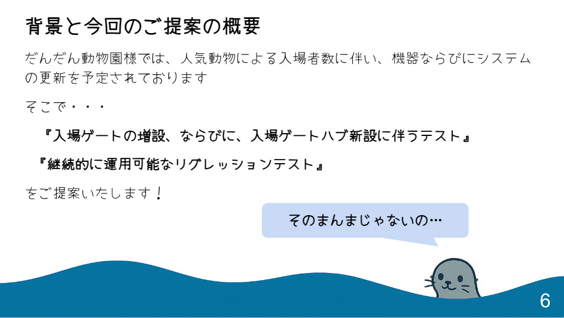

タイトルにもある通り、[2023年の優勝](https://tyngw.hatenablog.com/entry/2024/01/28/101230)以来、2年ぶり2回目にテスト設計コンテスト(以下、テスコン)に優勝しました。

前回出場した際に、「次は複数人で出場してみたら？」と声をかけていただいたのですが、結局今回もヒト属として出場したのは私一人でした。  
ただし、今回は AI Agent という力強いパートナーに協力してもらったことにより、私の右腕として大いに活躍してもらいました。  

[f:id:tyngw:20260125145031j:plain:w240]

学校・法人枠での参加ではないため、こんな立派なトロフィーをどこに飾ろうと毎回悩んでおります。  
そんなAI Agentには物理的なトロフィーは渡せないので、彼にはCreditを授与して更に頑張ってもらおうと思います。  

前回優勝時の記事ではなぜソロでテスコンに参加したのかを中心に書きましたが、今回の参加の目的は次の2点だけなので、簡便に済ませたいと思います。  

- 会社で「AIを活用せよ」というお達しが出ていたので、やらざるを得ない状況に。テスコンの場がプライベートで勉強がてらテストプロセスにAIを適用する良い機会だった
- 出場者数が少なかった前年の状況を踏まえ、盛り立て役として参加した

今回、オフラインでは追加で座席を用意しなければならないほど盛況なイベントとなったので、思い上がりも甚だしいですが、少しは目的を果たせたのではないかと思います。  
現地で成果物を見ていただいた方もいらっしゃるかと思いますが、落ち着いて読むのは難しかったと思うので、本稿では改めてスライドと共に成果物を振り返ってみたいと思います。  

ちなみに、JaSST'26 Tokyoでも、各チームの(許可が得られた)成果物が展示される予定らしいので、残念ながらテスト設計コンテスト決勝会場に来られなかった方は、検討してみてください。  

## 今回のお題

テストベースは前年に引き続き、動物園の入場管理システムでした。  
当初は、コロナ禍を想定して時間枠毎に限られた入場枠を設定し、「密」にならないようにすることを目的に設置されていましたが、  
昨今の感染症の状況や、人気動物による入場者数の増加に伴い、1つしかなかった入場ゲートを増設する変更が行われるので、  
その差分に対するテスト設計と、今後も同様の変更があった際に大きな問題が起きないようリグレッションテストを検討して欲しいと言うオーダーでした。  

d
