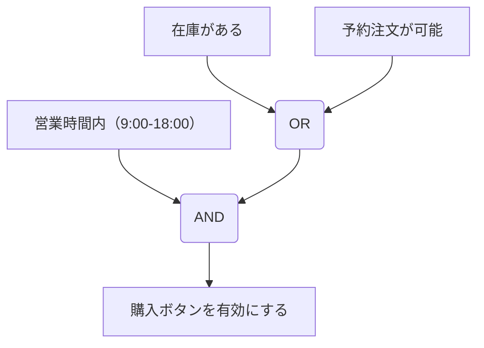

## はじめに

タイトルにもある通り、2年ぶり2回目でテスト設計コンテスト(以下、テスコン) OPENクラスで優勝という評価をいただきました。  

前回出場した際に、実行委員の方から「次は複数人で出場してみたら？」と声をかけていただいたのですが、結局今回もチーム内でヒト属として出場したのは私一人でした。  
ただし、今回は AI Agent という力強いパートナーに協力してもらったことにより、私の相棒として大いに活躍してもらいました。  

学校・法人枠での参加ではないため、こんな立派なトロフィーをどこに飾ろうと毎回悩んでおります。  
そんなAI Agentには物理的なトロフィーは渡せないので、彼にはCreditを授与して更に頑張ってもらおうと思います。  

(ここにトロフィー画像)

[前回優勝時の記事](https://tyngw.hatenablog.com/entry/2024/01/28/101230)ではなぜソロでテスコンに参加したのかを中心に書きましたが、今回の参加の目的は次の2点だけなので、簡便に済ませたいと思います。  
* 会社で「AIを活用せよ」というお達しが出ており、やらざるを得ない状況に。テスコンの場は、プライベートで勉強がてらテストプロセスにAIを適用する良い機会だった
* 出場者数が少なかった前年の状況を踏まえ、盛り立て役として参加した

今回、オフラインでは追加で座席を用意しなければならないほど盛況なイベントとなったので、思い上がりも甚だしいですが、少しは目的を果たせたのではないかと思います。  
現地で成果物を見ていただいた方もいらっしゃるかと思いますが、落ち着いて読むのは難しかったと思うので、改めてスライドと共に成果物を振り返ってみたいと思います。  

ちなみに、JaSST'26 Tokyoでも、各チームの(許可が得られた)成果物が展示される予定らしいので、残念ながらテスト設計コンテスト決勝会場に来られなかった方は、JaSSTを楽しみにしていてくださいね！  

## 今回のお題と提案内容

テストベースは前年に引き続き、動物園の入場管理システムでした。  
当初は、コロナ禍を想定して時間枠毎に限られた入場枠を設定し、「密」にならないようにすることを目的に設置されていましたが、  
昨今の感染症の状況や、人気動物による入場者数の増加に伴い、1つしかなかった入場ゲートを増設する変更が行われるので、  
その差分に対するテスト設計と、今後も同様の変更があった際に大きな問題が起きないようリグレッションテストを検討して欲しいと言うオーダーでした。  

提案内容も、そのオーダーから大きく変えることなく、スライドにある2点にフォーカスしました。  

(ここに背景スライド)

## 提案内容に関する余談

発表では、『時間がないので2番目の「継続的に運用可能なリグレッションテスト」にフォーカスします』と述べたのですが、  
実際のところ、入場ゲートの増設や、入場ゲートハブの新設に伴うテスト設計が決勝に向けてブラッシュアップする余裕がなく、  
かなり浅い内容になってしまっていました。そのため、アピールできることがない状態だったのです。  
常に第一線でご活躍されてこられた審査員の方々には、そのことをすっかり見透かされてしまって、ご指摘をいただくことになりました。（それはそう）  

ただ、入場ゲートの増設に当たって、これまで入場ゲートを接続していた入場管理システムにそのまま新設した入場ゲートを接続するのではなく、  
入場ゲートハブという中間機器を新設して接続するというアーキテクチャの変更が行われていたことについては、テスト要求分析の一環として、以下のような内容を成果物に盛り込んでいました。  

> なぜ入場管理に直接入場ゲートを接続せず、入場ゲートハブを新設したのか？
> 入場管理に増設した入場ゲートを含む複数の入場ゲートを接続した場合の影響、特に、非機能面でどのような影響があるのか？

この分析結果については、今回テスト設計コンテストの一連のイベントとして初開催された [【OPENクラス】テスト設計コンテスト'25 決勝戦開催直前！～予選振り返りスペシャル！](https://aster.connpass.com/event/376615/) の中でも、審査員の方からポジティブなご意見をいただきました。  
ただ、

draft
- 開発者とテストをする人の帽子の被り直し
- 変更内容をそのまま受け取るだけでなく、その変更が行われることになった背景やシステム上のボトルネックを把握


結果としては、せっかくテスト要求分析で良いところを突いたのに、そこから設計に落とし込みきれていないというとても勿体無い結果になってしまいました。  

## 継続的に運用可能なリグレッションテストって？

リグレッションテストの定義と、リグレッションテストの課題については、すでに [よいリグレッションテストとは何なのか](https://tyngw.hatenablog.com/entry/2025/06/30/regression-test) で述べた通りです。((テスコンに向けたポジションペーパーの位置付けで書いたつもりだったので、他の参加チームとよいリグレッションテストとは何かについて議論できることを楽しみにしていたのですが、意外にもリグレッションテストをアピールされていたチームは少なかったです。))  
このエントリでは、さも良いリグレッションテストを知っているかのように書いていますが「じゃあアシカさんよ〜、実際によいリグレッションテストの具体例を示しなさいよ」という読者の皆さんへのアンサーを示す場こそがテスコンの決勝の場でした。

簡潔に言えば、「継続的に運用可能なリグレッションテスト」とは、ソフトウェアの変更が加えられるたびに繰り返し実施されるリグレッションテストを、限られたリソースの中で効率的に保守・実行し続けられるテスト設計のことです。

### リグレッションテストが抱える課題

[前回のエントリ](https://tyngw.hatenablog.com/entry/2025/06/30/regression-test)でも述べたように、リグレッションテストは継続的に実施されるテストであるため、次のような課題に直面することが多いのです。

- テストスイートが増え続け、現実的なリソースでテストを実施することが困難になる
- テストの追加基準が曖昧なため、何をテストすべきか判断しにくい
- 担当者の異動や交代により、テストの目的や意図が失われてしまう
- リリース直前に重篤な障害が発見され、スケジュールに影響を及ぼす

こうした課題が生じる背景には、リグレッションテストが「継続的に実施されるテスト」であることが関係しています。一人の担当者が同じテストスイートを保守し続けることは稀であり、複数人で保守したり、担当者が交代したりする中で、テストの追加基準やテスト目的が曖昧になってしまうのです。

### 提案のアプローチ

今回のテスト設計では、この課題に対応するため、次の3つのアプローチを組み合わせました。

#### 1. リスク分析に基づくテスト設計

まず、ステークホルダーを識別し、各機能が動作しなかった場合に「誰にどのような影響を及ぼすのか」を評価します。動物園の入場管理システムであれば、来園者、経営者、係員、補助金担当者といったステークホルダーが存在し、それぞれ異なる関心事を持っています。

リスク分析では、重篤度（Impact Level）と発生頻度（Frequency）の2つの視点からリスクを評価します。重篤度は「直接的な影響度」「関連機能への波及影響度」「短期的な金銭的影響度」「長期的な信頼喪失影響度」の4項目を考慮し、発生頻度は「露出度」と「脆弱性」の2項目を考慮します。

このように構造化することで、「テストを実施しなかった場合のリスク」を関係者間で共有でき、リソースが限られている場合に「このテストは実施しない」という判断を根拠を持って下すことができるようになるのです。

#### 2. Test Sizeに基づくテストレベルの定義

次に、Googleが提案しているTest Sizeの考え方を参考に、テストレベルを定義しました。Small、Medium、Largeの3段階で、ネットワークアクセス、データベース、ファイルシステムアクセス、実行時間などの基準を設けます。

- **Small**: ネットワークアクセスなし、データベースなし、実行時間60秒以内
- **Medium**: ローカルネットワークのみ、データベースあり、実行時間300秒以内
- **Large**: 外部システムとの連携あり、実行時間1800秒以上

このように判定基準を設けることで、異なるテストレベルで同じテスト目的を持ったテストが重複して実装されることを防ぎます。また、テストピラミッドの考え方に基づき、実行速度の速いSmallテストで多くのテスト要求を満たすことで、リグレッションテスト全体の実行時間を短縮できるのです。

#### 3. AIと協業するテスト設計プロセス

そして、AIの活用です。リスク抽出からテストケース生成まで、AIが初期作業を支援することで、テスト設計の効率化を図りました。

ただし、AIが生成したテスト設計成果物を鵜呑みにすることはできません。ステークホルダーに根拠ある判断をしてもらうためには、AIが生成した内容を人間がレビューし、修正することが重要です。そのため、構造化データ（JSON形式）で出力し、専用のビューアを用いてレビューを行うプロセスを設計しました。

### リグレッションテストにおけるリスクの捉え方

ここで重要な視点が、リグレッションテストにおけるリスクの捉え方です。新規実装箇所や変更箇所に対するテストと、リグレッションテストでは、リスクに対する考え方が異なります。

**新規実装・変更箇所に対するテスト**では、テストをすることで確信を持ちたいため、新しい欠陥が見つかる可能性が高いと想定します。そのため、リスクの考慮漏れがあると欠陥を見逃すことに繋がるため、できる限りさまざまなリスクを抽出する必要があります。

一方、**リグレッションテスト**では、変更していない（影響を及ぼしていないはずの）箇所に対するテストなので、リグレッションがないことを前提として考えています。新しい欠陥が見つかる可能性は低く、できるだけコストもかけたくないのです。そのため、主に仕様に定義される論理的な関係が満たされていることの確認にフォーカスし、機能不動作が起きた時に「誰にどのような影響があるか」をベースに機能ごとに分析していくのです。

つまり、リグレッションテストのリスク分析においては、**ある機能が動作しなかった場合**に、**誰にどのような影響を及ぼすのか**を評価することが重要なのです。

この視点の違いを理解することで、限られたリソースの中で、より効果的なリグレッションテストを設計することができるようになります。

## 具体的な実装例

では、実際にどのようにテスト設計を進めたのか、具体例を示してみたいと思います。

### 業務分析から始まる

まず、システム化前に行われていた人間の仕事の単位で「業務」として分割します。これは、RDRAの業務の考え方を参考にしていますが、テスト設計では、システム化後に発生する新たな業務（例えば、システムの運用・保守に関わる業務）も含めて分析対象とします。

園内チケットシステムであれば、「園内チケットシステム起動・終了・ナビゲーション業務」「いますぐ入場券購入業務」「時間指定入場券購入業務」といった業務が抽出されます。

### リスク項目の抽出

次に、各業務に関連する機能について、「その機能が動作しなかった場合、誰にどのような影響を及ぼすのか」という視点でリスク項目を抽出します。

AIに対して、仕様書の該当セクションと業務分析の結果を与えることで、リスク項目をJSON形式で出力させました。例えば、「発券機起動時の初期化制御ロジックエラー」というリスク項目であれば、次のような構造で出力されます。

```json
{
  "risk_id": "B-Park-001-EH100-R001",
  "risk_title": "発券機起動時の初期化制御ロジックエラー",
  "risk_description": "発券機のハードウェア初期化等必要な起動処理において、初期化ステップの制御ロジックの誤り、または初期化の進行状態を示すデータが正常に更新されない場合",
  "failure_scenario": "起動時の初期化ステップの順序が誤っている、または各ステップの完了判定が失敗する。仕様書では『障害停止画面（S-008-01）を表示する』と記述されているが、その条件判定が誤り、エラーを検出しても画面表示が実行されない、または無限ループに陥る",
  "impacts": [
    {
      "stakeholder": "動物園入場者",
      "effect": "入場券購入ができず、入場が遅延し、来園者の不満が生じる"
    },
    {
      "stakeholder": "動物園経営者",
      "effect": "営業開始時刻の遅延により、営業機会損失が発生する"
    },
    {
      "stakeholder": "動物園係員",
      "effect": "営業開始前の障害対応が必要となり、開園準備業務が遅延する。初期化ロジックのデバッグや修正作業が増加する"
    },
    {
      "stakeholder": "だんだん市補助金担当者",
      "effect": "システムの安定稼働が確認できず、補助金交付要件の充足性に疑義が生じる"
    }
  ],
  "impact_level": {
    "blast_radius": 3,
    "functional_spread": 5,
    "short_term": 2,
    "long_term": 5,
    "level": "02.A"
  },
  "frequency": {
    "exposure": 5,
    "fragility": 3,
    "level": "01.H"
  }
}
```

このように、ステークホルダー別の影響を構造化することで、そのリスクの重要度が一目瞭然になるのです。JSON形式で出力することで、後続のレビューやフィルタリングが容易になります。

### ラルフチャートによる抽象的テストケースの設計

リスク項目に関連する目的機能を洗い出した上で、ラルフチャート（Robust And Logical Function Chart）を用いて、テストケースを抽象化します。ラルフチャートは、入力（Input）、状態（State）、ノイズ（Noise）、能動的ノイズ（Active Noise）、出力（Output）の5つの要素で構成されます。

例えば、「発券機起動」というテストであれば、AIに対して前述のリスク項目と仕様書を与えることで、次のような抽象的テストケースが生成されます。

```json
{
  "abstract_tc_id": "B-Park-001-EH100-R001-ATC001",
  "purpose_function": "動物園係員として、発券機を起動して営業開始できる状態にしたい。入場者へのチケット販売を開始するためだ。",
  "target_function": "EH-100: 発券機起動",
  "inputs": [
    {
      "name": "起動操作",
      "values": ["電源ON"]
    }
  ],
  "state": [
    {
      "name": "発券機の前回終了状態",
      "values": ["正常終了", "異常終了"]
    }
  ],
  "noise": [
    {
      "name": "通信状況",
      "values": ["入場管理との通信正常", "入場管理との通信遅延", "入場管理との通信タイムアウト"]
    },
    {
      "name": "起動タイミング",
      "values": ["営業開始前", "営業時間中"]
    }
  ],
  "active_noise": [],
  "outputs": [
    "正常時: ハードウェア初期化完了後、開始画面（S-001-01）表示",
    "正常時: 残数アイコン切替閾値の取得完了"
  ]
}
```

このように、考慮すべき因子を構造化することで、テストケースの抜け漏れを防ぐことができるのです。AIが生成したラルフチャートは、専用のビューアで視覚的に確認しながらレビューを行い、不足している因子や不適切な値がないかを人間が検証します。

### テスト実装方針の決定

抽象的テストケースが決まったら、どのテストレベルで、どのテスト技法を用いて実装するかを決定します。

テスト技法の選択優先順位は、次の通りです。

1. **シナリオテスト**: ユーザーが実際に行う操作フロー全体を通じて、ビジネスゴールが達成できるか確認する
2. **原因結果グラフ・デシジョンテーブル**: 複数の条件の組み合わせによって動作が決まる場合
3. **状態遷移テスト**: システムの状態変化によって振る舞いが変わる場合
4. **障害許容性テスト**: エラー・例外・障害が発生したときに特にリスクが高い場合
5. **境界値分析・同値分割**: 数量・時間・閾値などの境界付近で仕様に明記された動作変化がある場合

AIに対して抽象的テストケースを与えることで、次のような実装方針が生成されます。

```json
{
  "abstract_tc_id": "B-Park-001-EH100-R001-ATC001",
  "implementation": [
    {
      "implementation_id": "B-Park-001-EH100-R001-ATC001-IMPL001",
      "testing_technique": "シナリオテスト",
      "testing_purpose": "発券機起動時のハードウェア初期化と障害検出が仕様通りに動作し、正常系ではメニュー画面が表示され、障害時には障害停止画面が表示される",
      "test_size": "Medium",
      "quality_characteristic": "機能適合性",
      "quality_sub_characteristic": "機能完全性"
    }
  ]
}
```

このように、各テストケースに対して、テスト技法とテストサイズが紐づけられます。例えば、入場券の状態遷移（未使用 → 使用済み、未使用 → 無効）をテストする場合は、状態遷移テストを選択し、テストサイズはSmallとします。一方、複数の入場ゲートからの同時入場処理をテストする場合は、シナリオテストを選択し、テストサイズはMediumまたはLargeとするといった具合です。

このプロセスを通じて、AIが生成した実装方針を人間がレビューし、テスト技法の選択が適切か、テストサイズの判定が妥当かを検証します。

## AIとの協業で得られた効果

今回、AIを活用することで、次のような効果が得られました。

### テスト設計の効率化

リスク抽出からラルフチャート作成、テストケース生成までをAIが支援することで、テスト設計の初期作業時間を大幅に短縮できました。ただし、AIが生成した内容をレビューする工数は従来のプロセスよりも必要になります。そのため、専用のビューアツールによるレビューと修正のプロセスを設計することで、レビューの効率化を図りました。

実際のところ、業務分析から抽出された各業務に対して、AIが生成したリスク項目は数十から数百に及びました。これらを全て手作業で抽出していたら、相当な時間がかかっていたはずです。一方で、AIが生成したリスク項目の中には、仕様書の記述から導き出しにくい項目や、逆に過度に詳細化されている項目も含まれていたため、人間によるレビューと修正は必須でした。

### 仕様理解の深化

原因結果グラフ生成ツールにより、仕様書の論理関係を素早く可視化することができました。文章で記述された状態では気づけない論理関係を素早くモデル化することで、仕様の理解にも役立てることができたのです。

実際のところ、このプロセスを通じて、提供いただいた要求仕様書に記述の誤りを検出することもできました。例えば、「号機Noによるいますぐ入場券メニュー遷移制御」という仕様項目について、原因結果グラフを生成する過程で、仕様書に記述されている条件分岐の論理が矛盾していることに気づくことができたのです。

#### 原因結果グラフ（CEG）とは

原因結果グラフは、ソフトウェア仕様における入力条件（原因）と出力動作（結果）の論理関係を視覚的に表現する手法です。仕様文から「原因」「結果」「論理ゲート」「制約」を抽出し、Mermaidなどのダイアグラムツールで可視化します。

**基本要素**:
- **原因（Cause）**: システムへの入力条件、トリガー、前提条件
- **結果（Effect）**: システムの出力動作、振る舞い、状態変化
- **論理ゲート**: AND、OR、NOT、XORなど、原因と結果の論理関係を表現
- **制約（Constraint）**: 原因間の依存関係や制限（ONE、EXCL、INCL、REQ、MASK）

#### CEG生成プロンプトの活用

AIに対して、仕様書の特定セクションを与え、原因結果グラフを生成させるプロンプトを設計しました。このプロンプトでは、次のような分析手順を明示しています。

**ステップ1: 原因の特定**

仕様文から入力条件やトリガーを抽出します。例えば、「残数が0となった時点で販売不可にする」という仕様であれば、原因は「残数が0」となります。

重要な注意点として、「AとA以外」「AとAでない」のような対立する条件がある場合、これらを2つの独立した原因として扱わず、1つの原因「A」のみを定義し、NOTゲートで「A以外」を表現します。

**ステップ2: 結果の特定**

仕様文から出力動作や振る舞いを抽出します。「販売不可にする」「画面表示する」「データ保存する」といった動詞で表現される動作が結果となります。

**ステップ3: 論理関係の判定**

原因と結果の間の論理関係を判定します。

- **OR**: 「AまたはB」「Aか、またはB」→ いずれかの条件が成立すれば十分
- **AND**: 「AかつB」「AおよびB」→ すべての条件が成立する必要がある
- **NOT**: 「Aでない」「A以外」→ 原因の否定（中間ノードとして使用）

**ステップ4: 制約の特定**

原因間の制約を特定します。

- **ONE制約**: 複数の排他的な選択肢のうち、必ず1つだけが真（例: 支払方法は現金、カード、電子マネーのいずれか1つ）
- **EXCL制約**: 2つ以上の原因が同時に真になることはできない（例: 「新規登録」と「ログイン」は同時に実行できない）
- **INCL制約**: ある原因が真なら、別の原因も真でなければならない（例: 「プレミアム機能を使用」ならば「有料会員である」）
- **REQ制約**: ある原因が真になるためには、別の原因が先に真になっている必要がある（例: 「商品ボタンを押す」には「お金を先に入れる」ことが必要）
- **MASK制約**: ある原因が真の時に、別の原因の値を無視する（例: 「管理者モード」が真の時、「権限チェック」を無視する）

#### CEG生成の具体例

例えば、「営業時間内（9:00-18:00）で、かつ（在庫がある、または予約注文が可能）の場合、購入ボタンを有効にする」という仕様であれば、次のような原因結果グラフが生成されます。



このように、複雑な論理関係を視覚的に表現することで、仕様の理解が深まり、テストケースの設計がより正確になるのです。

AIが生成したCEGは、人間がレビューし、論理関係や制約が正確に表現されているかを検証します。このプロセスを通じて、仕様書の曖昧さや矛盾を発見することができるのです。

### 継続的な改善の実現

構造化されたデータとして一意のIDを振って管理することで、ソフトウェアの変更に伴うテストスイートの更新・追加が容易になります。テストの目的とリスクが明確に記録されているため、担当者の交代があってもテストの意図を維持できるのです。

例えば、今後、新しい入場ゲートが追加される場合、既存のリスク項目から「入場ゲート関連」のリスク項目を抽出し、新しい入場ゲートに対して同様のテストを適用することができます。このように、テスト設計の再利用性が高まることで、次の変更開発時のテスト設計工数を削減できるのです。

## おわりに

今回のテスト設計コンテストでは、「継続的に運用可能なリグレッションテスト」という、実務的で重要なテーマに取り組むことができました。

AIの活用により、テスト設計の効率化が期待される一方で、AIが生成したテスト設計成果物を鵜呑みにすることはできません。ステークホルダーに根拠ある判断をしてもらうためには、人間がレビューし、修正することが重要です。

このように、AIと人間が協業するテスト設計プロセスを確立することで、今後の変更開発においても同様のアプローチで効率的にリグレッションテストを設計・保守できるのではないかと考えています。

テスト設計コンテストという場を通じて、こうした実践的なアプローチを提案できたことは、私にとって大きな学びとなりました。そして、AIというパートナーとの協業の可能性を感じることができたのです。

